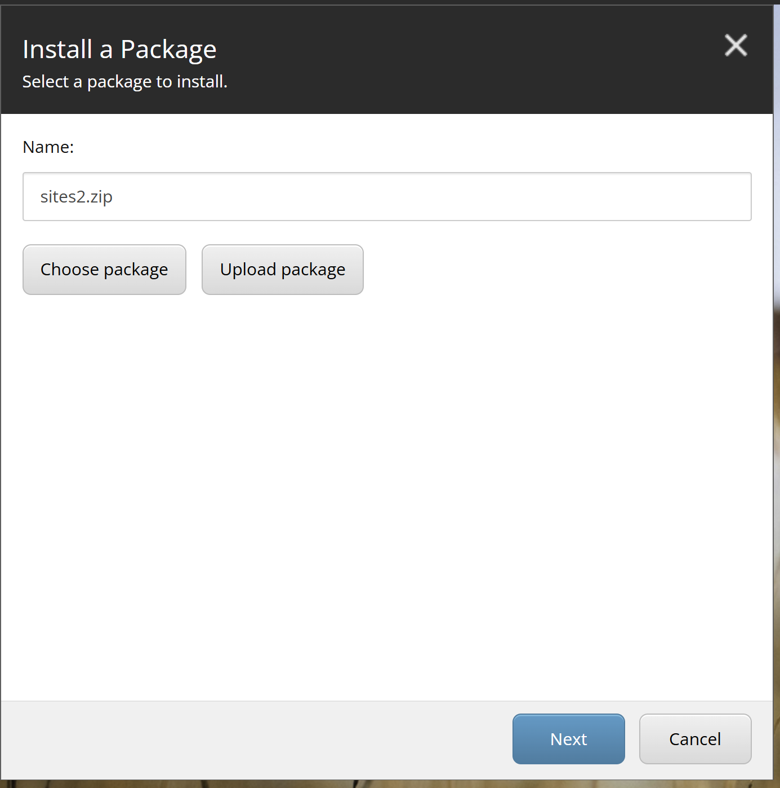
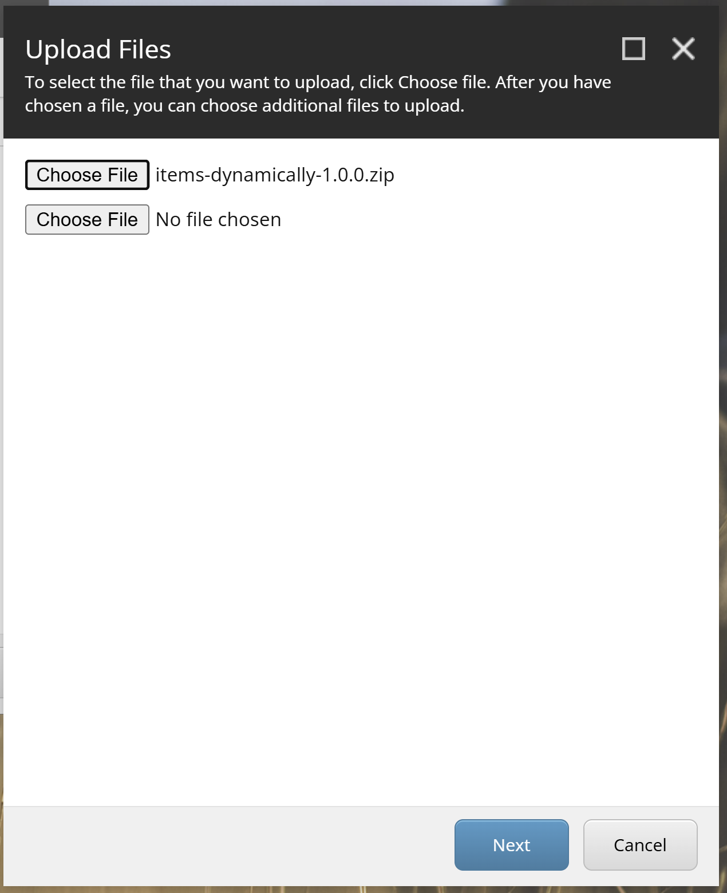
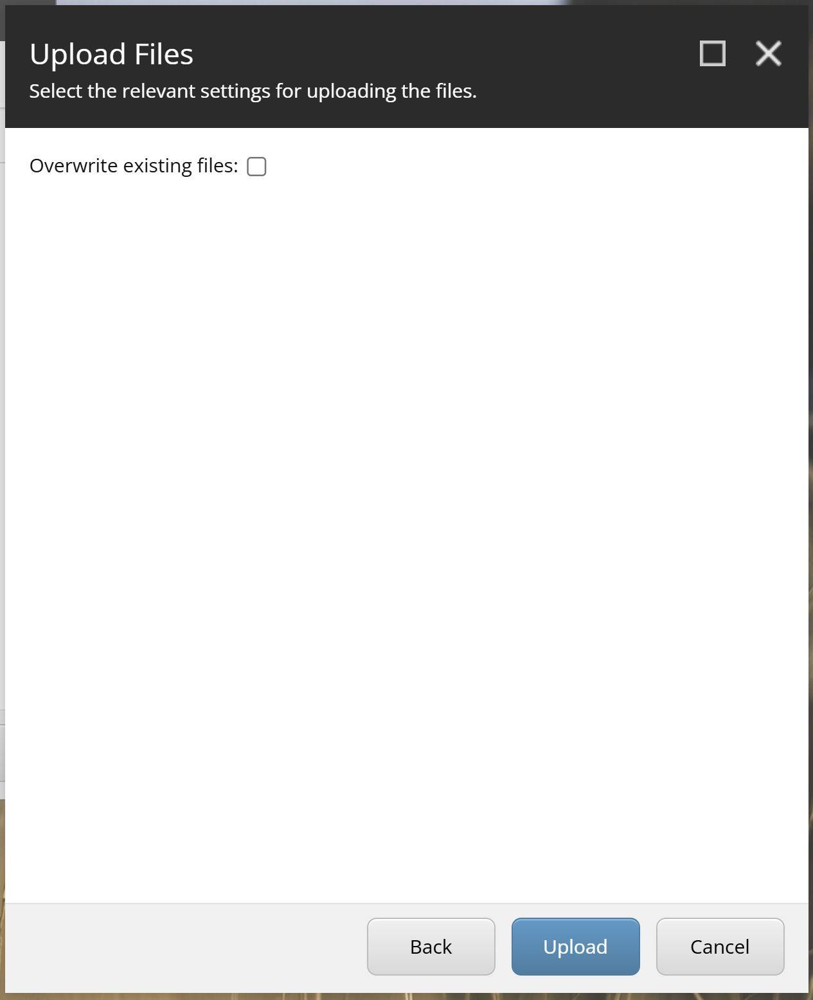
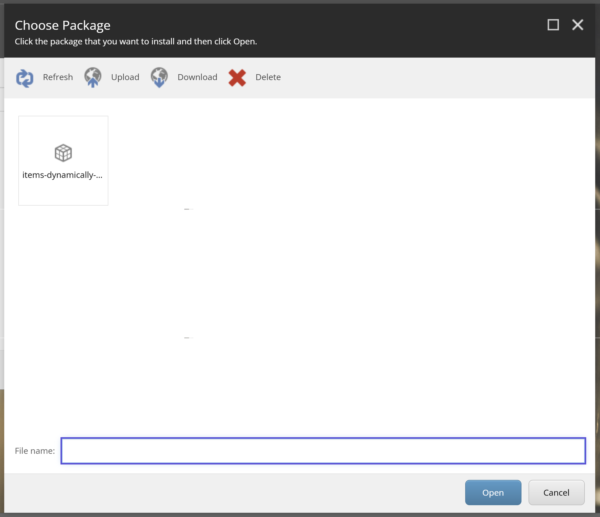
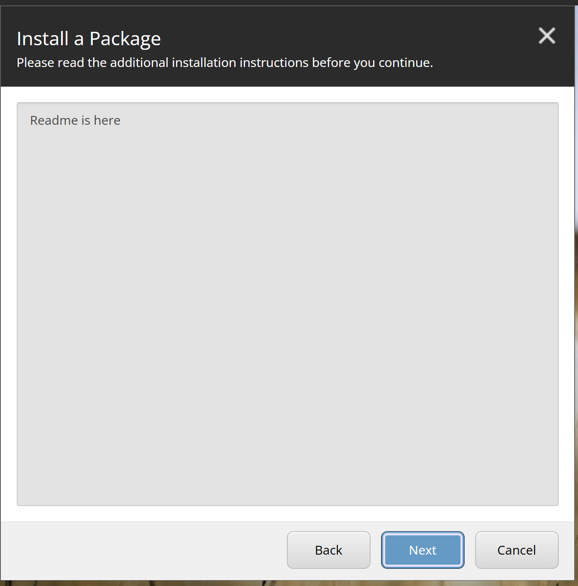
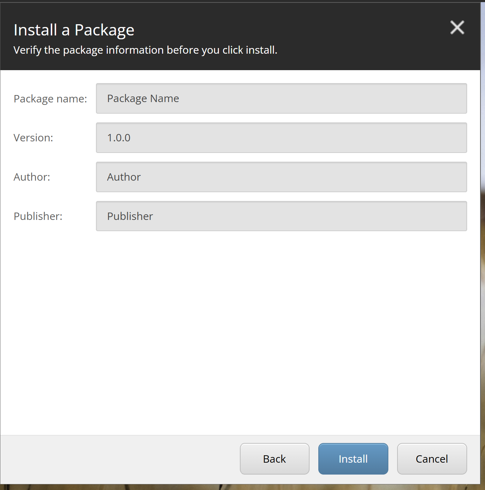
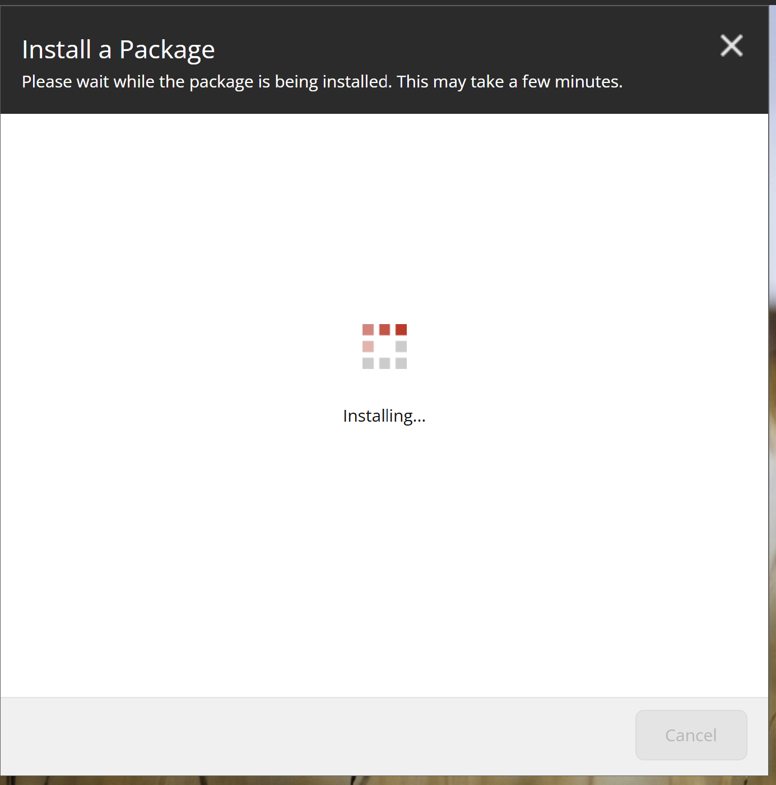
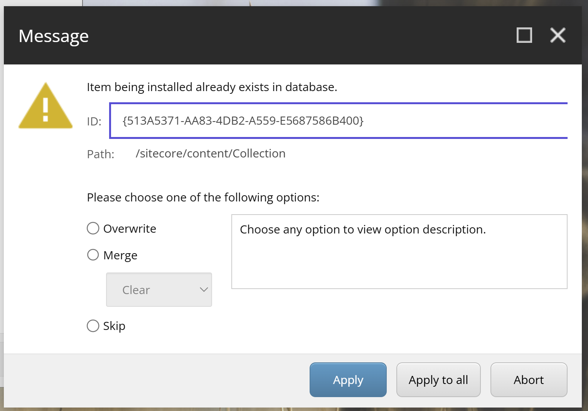
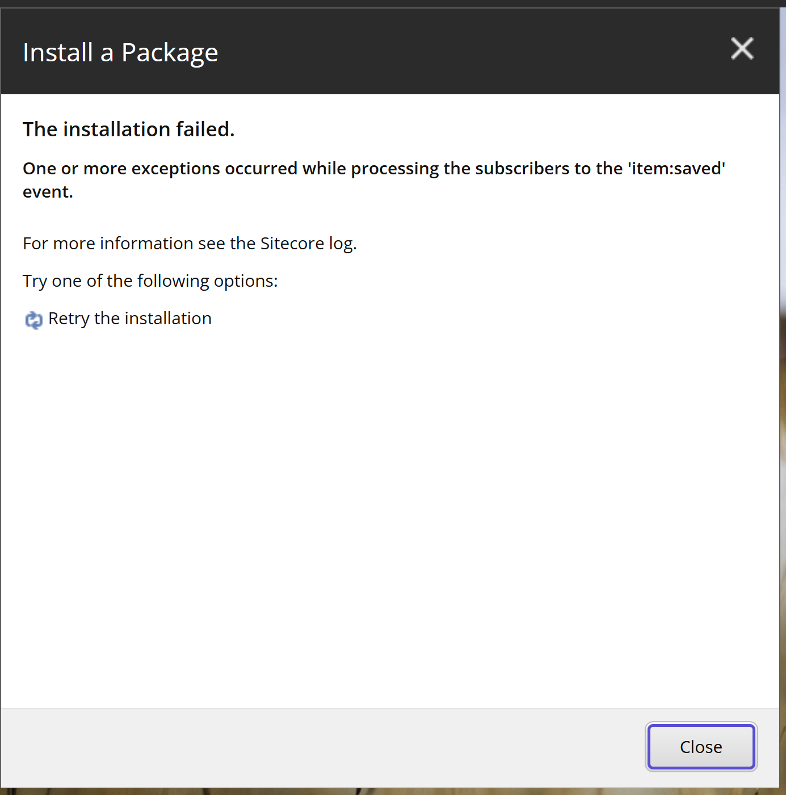

# Installation Wizard UI (legacy) — UX blueprint

How the classic **Sitecore Installation Wizard** / **Package Installation Wizard**
(Desktop → Development Tools → Installation Wizard, or Control Panel → Install a package) looks
and flows, screen by screen. This is the **install** side of the legacy tooling we're replacing;
the goal is to make our Marketplace app's *Install package* experience feel as close to this as
possible. The install pipeline and merge-mode semantics are in [[package-installation]] (with the
item detail in [[item-serialization]]); the app shell is [[sitecore-marketplace-app]].

> Built interactively from Sitecore docs + community blogs and **user-supplied screenshots** of a
> live Sitecore 10.x Installation Wizard. Each screen below is transcribed from a real screenshot.

## Screens

> **Observed flow (modern Sitecore 10.x).** The actual wizard differs from older blog walkthroughs:
> there is a **Readme** step (not a separate license screen), package metadata and "ready to install"
> are merged into one **Verify** screen, and the collision dialog offers **Overwrite / Merge / Skip**
> (no "Side by side"). Screens below follow the real sequence.

### 1. Launch

Launch from **Sitecore Desktop → Development Tools → Installation Wizard** (next to Package Designer
— see [[package-designer-ui]] Screen 1), or via the **Launch wizard** button in the Package Designer
ribbon, or **Control Panel → Install a package**. All routes open the same **Install a Package**
wizard.

> **→ Our app:** the *Install* entry point in the Standalone extension ([[sitecore-marketplace-app]]).

### 2. Select a package

First screen: **Install a Package**, subtitle *"Select a package to install."*

- **Name:** text field showing the chosen package (e.g. `sites2.zip`).
- Two buttons: **Choose package** (pick one already on the server) and **Upload package** (send a
  new `.zip` from your machine).
- Footer: **Next** / **Cancel**.

### 3. Upload Files — choose file (upload path)

If you clicked **Upload package**: **Upload Files**, subtitle *"To select the file that you want to
upload, click Choose file. After you have chosen a file, you can choose additional files to upload."*

- A **Choose File** button + filename (e.g. `items-dynamically-1.0.0.zip`); a second **Choose File**
  row (*No file chosen*) lets you add more.
- Footer: **Next** / **Cancel**.

### 4. Upload Files — settings

**Upload Files**, subtitle *"Select the relevant settings for uploading the files."*

- **Overwrite existing files:** checkbox (**unchecked** by default) — overwrite a same-named package
  already in the server packages folder.
- Footer: **Back** / **Upload** / **Cancel**.

### 5. Choose Package (server browser — select path)

If you clicked **Choose package** instead: **Choose Package**, subtitle *"Click the package that you
want to install and then click Open."*

- A toolbar: **Refresh · Upload · Download · Delete** (same project-browser chrome as the designer's
  Save/Open, [[package-designer-ui]] Screen 11).
- A thumbnail grid of packages in the server folder (box icon + name, e.g. `items-dynamically-…`).
- A **File name:** field.
- Footer: **Open** / **Cancel**.

### 6. Readme / additional instructions

**Install a Package**, subtitle *"Please read the additional installation instructions before you
continue."* Shows the package's **Readme** text (the `sc_readme.txt` set in the designer's Metadata,
[[package-designer-ui]] Screen 3) in a read-only area. Footer: **Back** / **Next** / **Cancel**.

> A separate **license-agreement** screen can appear here if the package defines a license; this
> sample had none.

### 7. Verify package information

**Install a Package**, subtitle *"Verify the package information before you click install."*
Read-only fields: **Package name**, **Version**, **Author**, **Publisher**. This single screen
serves as both the metadata display and the final confirmation. Footer: **Back** / **Install** /
**Cancel**.

### 8. Installation progress

**Install a Package**, subtitle *"Please wait while the package is being installed. This may take a
few minutes."* An animated tile spinner with **Installing…**; **Cancel** is disabled. (Minimal
progress detail — no per-item count in the stock wizard.)

### 9. Item collision / conflict resolution ★

The pivotal screen. **During** installation, whenever the package contains an item that already
exists *and* that source's installation option was **Ask User** ([[package-designer-ui]] Screen 9),
a modal titled **Message** interrupts with a ⚠ warning:

- *"Item being installed already exists in database."*
- **ID:** the item GUID (e.g. `{513A5371-AA83-4DB2-A559-E5687586B400}`).
- **Path:** the item path (e.g. `/sitecore/content/Collection`).
- *"Please choose one of the following options:"* (radio):
  - **Overwrite**
  - **Merge** — with a sub-dropdown **Clear / Append / Merge**
  - **Skip**
- A description box: *"Choose any option to view option description."* (updates per selection).
- Footer: **Apply** (this item) / **Apply to all** (use this choice for every remaining conflict) /
  **Abort** (stop the install).

This is the install-time twin of the designer's per-source **Installation options**. The semantics
(Overwrite / Merge→Append·Merge·Clear / Skip) match the `InstallMode` / `MergeMode` in
[[package-installation]]. Note there is **no "Ask User"** here (that only makes sense at design
time) and **no "Side by side"** option in this version.

> **→ Our app:** this dialog is the heart of the *Install* UX. Replicate it faithfully — per-item
> ID/Path, the Overwrite/Merge(+submode)/Skip choice, and crucially **Apply / Apply to all / Abort**
> — re-implemented against the XMC Authoring API ([[item-serialization]]).

### 10. Result (success / failure)

A final **Install a Package** screen reports the outcome. On **failure** it shows e.g. *"The
installation failed. One or more exceptions occurred while processing the subscribers to the
'item:saved' event. For more information see the Sitecore log."* with a **↻ Retry the installation**
action and a **Close** button. On **success** it shows a completion message instead (and, when the
package defines post-steps, prompts such as restarting the Sitecore client/server).

> **→ Our app:** show a clear success/failure result with a per-item log and a retry affordance.
> Server restart/publish prompts are not applicable on SitecoreAI ([[sitecore-marketplace-app]]).

## Sources

- **User-supplied screenshots of a live Sitecore 10.x Installation Wizard**, 2026-06-22 (primary
  ground truth — every screen above is transcribed from a real screenshot).
- Research sweep (Sitecore docs incl. SDN archive + community blogs: getfishtank.com,
  sitecorecorner, sitecoreguild, doc.sitecore.com), 2026-06-21 — used to cross-check merge-mode
  wording; corrected where it diverged from the live UI (no "Side by side"; Readme not License).
- Merge-mode semantics cross-referenced with [[package-installation]] (decompiled `Sitecore.Kernel`).
