# Package Designer UI (legacy) — UX blueprint

How the classic **Sitecore Package Designer** (Desktop → Development Tools → Package Designer)
looks and flows, screen by screen. This is the **create** side of the legacy tooling we're
replacing; the goal is to make our Marketplace app's *Create package* experience feel as close
to this as possible. The package the designer produces is described in
[[package-definition-xml]], [[package-creation]], [[package-format]] and [[item-serialization]];
the app shell is [[sitecore-marketplace-app]].

> Built interactively from Sitecore docs + community blogs and **user-supplied screenshots** of a
> live Sitecore 10.x Package Designer. Each screen below is transcribed from a real screenshot.

## Screens

### 1. Launch

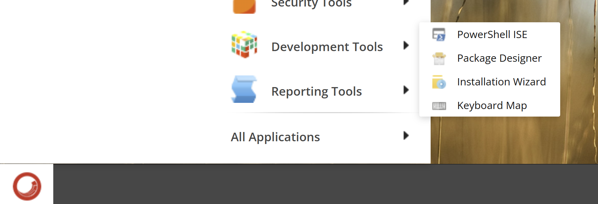

From the **Sitecore Desktop**, click the Sitecore Start button (red swirl, bottom-left) and open
the **Development Tools** group. Its submenu lists:

- **PowerShell ISE**
- **Package Designer** ← creates packages (this article)
- **Installation Wizard** ← installs packages (see [[installation-wizard-ui]])
- **Keyboard Map**

Both legacy tools we're replacing live side-by-side in this one menu group. Sibling groups in the
Start menu include **Security Tools** and **Reporting Tools**, then **All Applications**.

> **→ Our app:** the Marketplace app collapses this launch step — Create and Install are just two
> entry points in the Standalone extension ([[sitecore-marketplace-app]]); there is no Desktop.

### 2. Main window layout

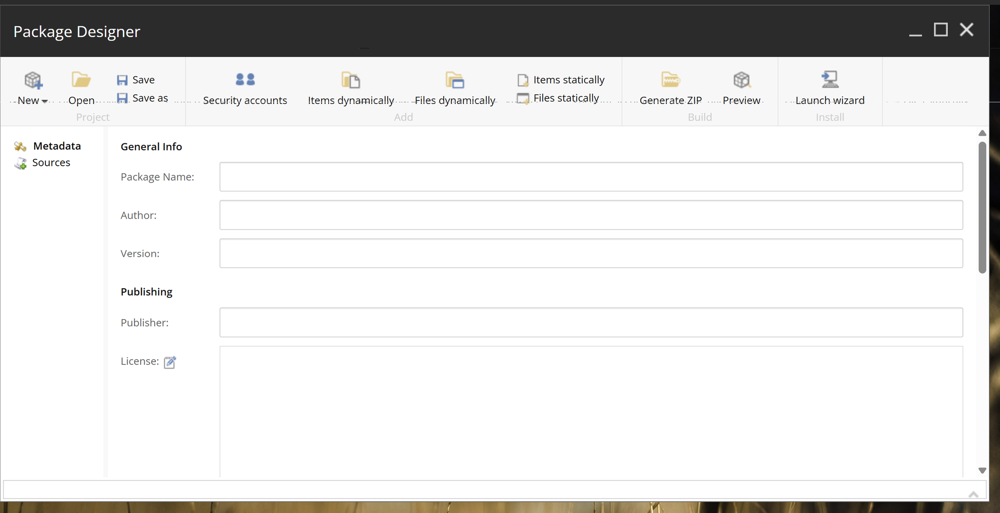

A single window titled **Package Designer** with a flat ribbon across the top, a left nav with two
pages, and a content area. The ribbon is grouped:

| Group | Buttons (exact labels) |
|-------|------------------------|
| **Project** | **New** ▾ (dropdown), **Open**, **Save**, **Save as** |
| **Add** | **Security accounts**, **Items dynamically**, **Files dynamically**, **Items statically**, **Files statically** |
| **Build** | **Generate ZIP**, **Preview** |
| **Install** | **Launch wizard** |

The left nav has exactly two pages:

- **Metadata** — the package-info form (Screen 3).
- **Sources** — the list of added item/file/security sources (Screens 4–10).

Notable vs. older docs: the modern ribbon exposes **Preview** (whole-package preview) and **Launch
wizard** (jumps straight into the Installation Wizard to test-install what you just built) directly
in the toolbar. The "Add" group is a flat row of five buttons rather than nested menus.

> **→ Our app:** mirror this as a two-pane *Create* screen — a **Metadata** form and a **Sources**
> list — with a top action bar for New/Open/Save and **Generate ZIP**. Static-vs-dynamic and
> items/files/security map to the five **Add** actions ([[package-definition-xml]]).

### 3. Metadata

The **Metadata** page (selected by default for a new project) is a scrolling form. Visible sections
and fields:

- **General Info**
  - **Package Name:** (text) — the only required field.
  - **Author:** (text)
  - **Version:** (text)
- **Publishing**
  - **Publisher:** (text)
  - **License:** (multi-line text, with a ✎ pencil icon that opens a rich editor)
  - **Comment:** (multi-line text)
  - **Read me:** (multi-line text, with a ✎ pencil icon — shown to the installer in the wizard)
- **System**
  - **Post Step:** (text — fully-qualified type of an `IPostStep` to run after install)
  - **Custom Attributes:** (a name/value pair — two side-by-side text boxes)

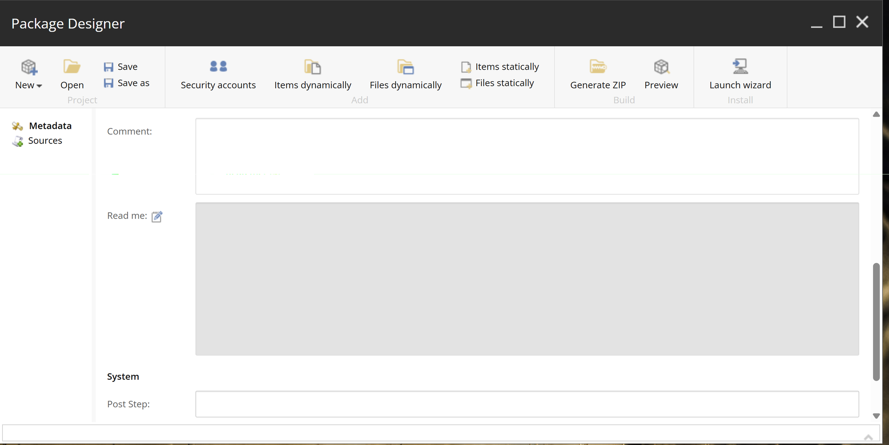
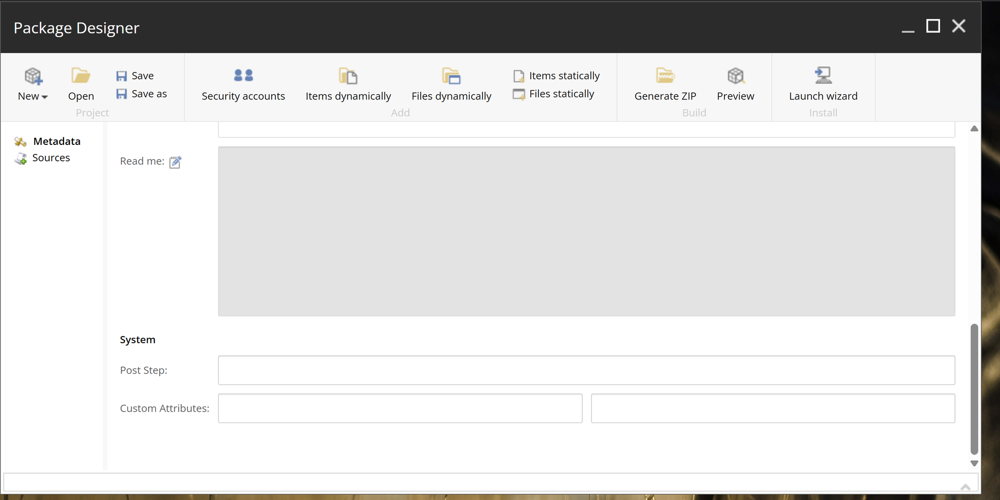

These map straight onto the `metadata/` package entries — `sc_name.txt`, `sc_author.txt`,
`sc_version.txt`, `sc_publisher.txt`, `sc_license.txt`, `sc_comment.txt`, `sc_readme.txt`,
`sc_poststep.txt`, plus any custom attribute ([[package-format]]).

> **→ Our app:** a straightforward metadata form with the same field names (General Info /
> Publishing / System grouping is a nice-to-keep), so generated packages' `metadata/` entries
> match byte-for-byte ([[package-creation]]). Post Step is a server-side concept — likely
> read-only / not applicable on SitecoreAI, but preserve it on round-trip.

### 4. Add items statically

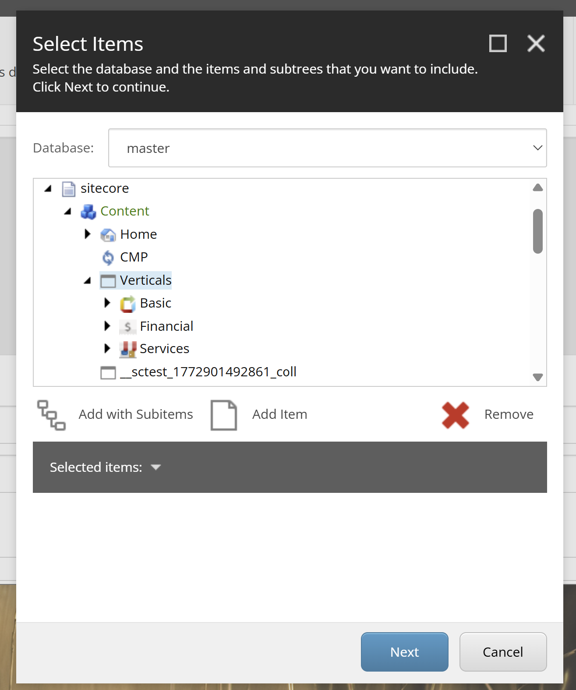

Clicking **Items statically** opens a modal titled **Select Items**, subtitle *"Select the database
and the items and subtrees that you want to include. Click Next to continue."* Layout top-to-bottom:

- **Database:** dropdown (e.g. `master`) — choose the source database.
- **Content tree** — the live Sitecore tree (sitecore → Content → Home / Verticals / …), expandable,
  single-select with a highlighted node.
- **Action row** under the tree:
  - **Add with Subitems** — adds the selected node **and its whole subtree** (recursively
    enumerated, statically).
  - **Add Item** — adds **only** the selected node.
  - **Remove** (red ✖) — removes a previously added entry.
- **Selected items:** ▾ — a collapsible bar listing everything added so far.
- Footer: **Next** (primary) / **Cancel**.

The key static-source trait: the tree is walked **now**, at design time, and each chosen item is
written as an explicit `<x-item>` entry — it will **not** pick up items created later
([[package-definition-xml]]). "Add with Subitems" expands the subtree into many static entries.

> **→ Our app:** replicate this as a database dropdown + item-tree picker (served via the XMC
> module / Authoring GraphQL) with **Add item** vs **Add with subitems** actions and a running
> "selected" list. This is the core of the *Create* flow for SitecoreAI ([[item-serialization]]).

### 5. Add items dynamically

A **dynamic** item source stores a *query* (root + filters) instead of a fixed item list, and is
re-resolved every time the package is generated — so it automatically picks up new items matching
the criteria. Clicking **Items dynamically** launches a multi-step wizard.

**Step 5a — Select Root Item.** Modal titled **Select Root Item**, subtitle *"Select the database
and the item where you want to start the search. Click Next to continue."*

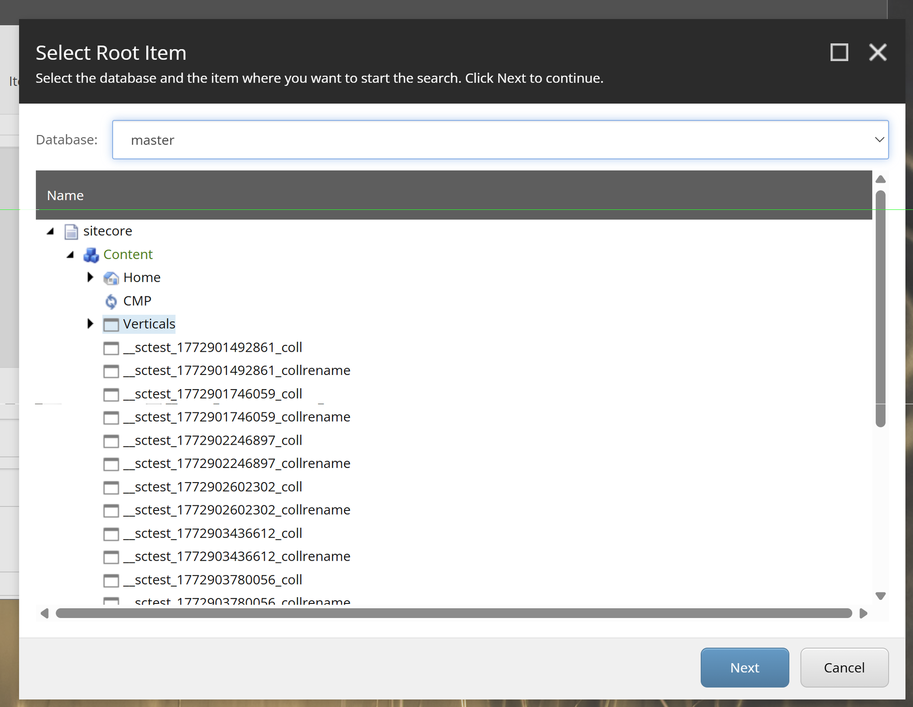

- **Database:** dropdown (e.g. `master`).
- A **Name**-column tree (sitecore → Content → …), **single-select** — pick the one root under
  which the search runs (unlike the static dialog, there's no Add/Remove; you choose exactly one
  root).
- Footer: **Next** / **Cancel**.

**Step 5b — Specify Source Filters.** Modal titled **Specify Source Filters**, subtitle *"Specify
the filters that you want to apply to the source. Click Next to continue."* It's one long scrolling
page; every section has its own **Clear Filter** button and is optional (leave blank = no
restriction). Footer: **Back** / **Next** / **Cancel**. Sections in order:

1. **Item name filter** — *All or part of the item name:* (text) + **Use:** dropdown whose options
   are **Simple Search** (default), Regular Expression, Wildcards.

   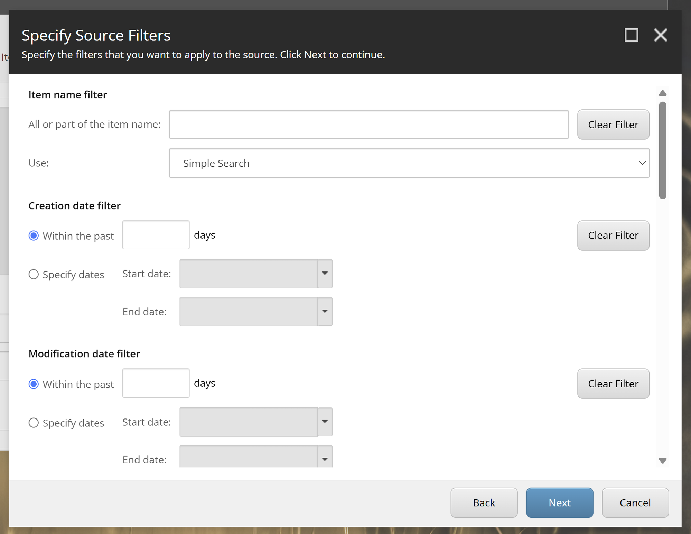

2. **Creation date filter** — radio choice: **Within the past** `[ ]` **days**, or **Specify dates**
   with **Start date:** / **End date:** pickers. (default radio = *Within the past*.)
3. **Modification date filter** — same shape as Creation date.
4. **Publish date filter** — a single **Publish date:** picker.

   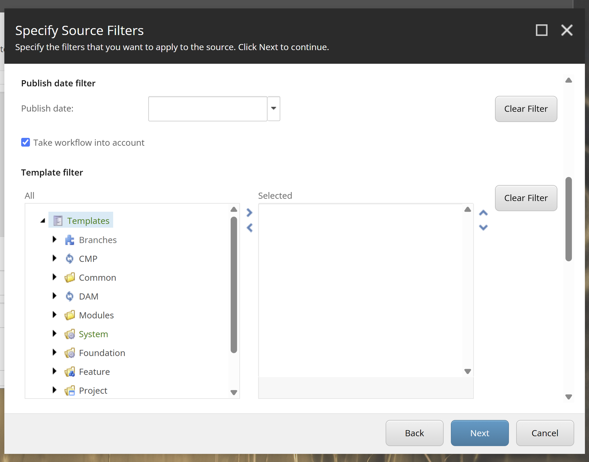

5. **Take workflow into account** — checkbox (**checked** by default).
6. **Template filter** — a dual-list picker: **All** (template tree: Branches, CMP, Common, DAM,
   Modules, System, Foundation, Feature, Project…) on the left, **Selected** list on the right, with
   **`>` / `<`** move buttons and **▲ / ▼** reorder buttons. Items whose template is in *Selected*
   are included.
7. **Created by filter** — a list box of accounts with **Add** / **Remove** buttons (Add opens an
   account picker).

   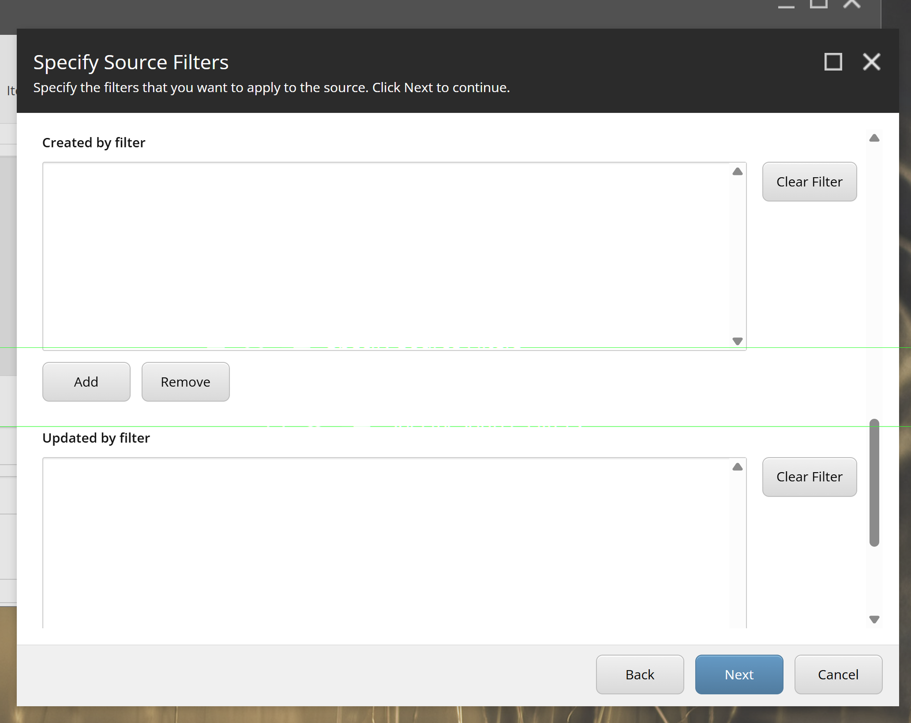

8. **Updated by filter** — same shape as Created by.
9. **Language filter** — a checkbox list of the site's languages (English, French (Canada),
   Japanese (Japan), Spanish (Spain)…); checking some restricts to those languages.

   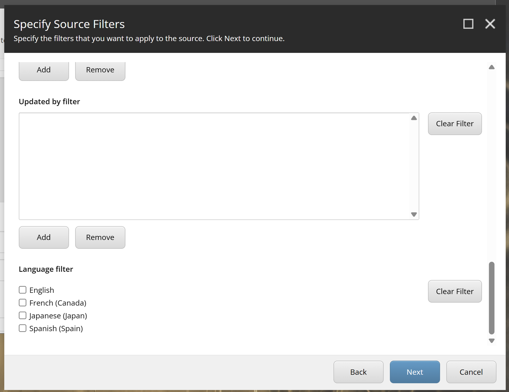

**Step 5c — Source name.** A final step with a **single text field** to name the source; the dynamic
source then appears in the **Sources** list. All of this serializes to the dynamic `<items>`
source (Root + `<Include>` filter chain) in [[package-definition-xml]]; the filters correspond to
`ItemNameFilter`, `ItemDateFilter`, `ItemTemplateFilter`, creator/editor and language filters.

> **→ Our app:** this is the most involved screen to replicate. For SitecoreAI we'd resolve the
> same root + filters via the XMC Authoring API at generation time. Worth keeping all nine filter
> types and the "re-resolve on regenerate" semantics, since that's the main reason teams choose
> dynamic over static sources.

### 6. Add files statically

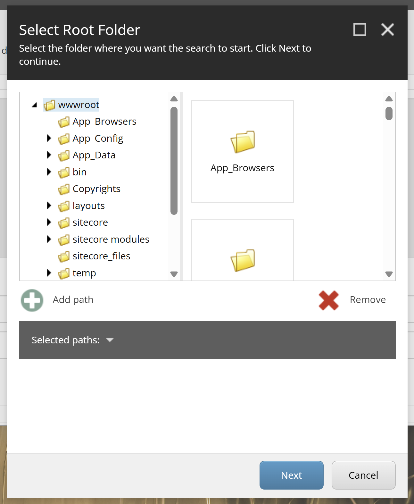

Clicking **Files statically** opens a modal titled **Select Root Folder**, subtitle *"Select the
folder where you want the search to start. Click Next to continue."* It's a file-system browser
over the Sitecore web root:

- **Left pane** — a folder tree rooted at **wwwroot** (App_Browsers, App_Config, App_Data, bin,
  Copyrights, layouts, sitecore, sitecore modules, sitecore_files, temp, …), expandable.
- **Right pane** — large folder/file thumbnails for the current node (Explorer-style).
- **Action row:** **Add path** (green ⊕) / **Remove** (red ✖).
- **Selected paths:** ▾ — collapsible list of the paths added so far.
- Footer: **Next** / **Cancel**.

You navigate to a file or folder and **Add path** to include it; each added path is enumerated
**now** into explicit file entries (a folder adds its contents). This is the file analogue of
**Items statically** — a fixed `<xfiles>` source ([[package-definition-xml]]).

> **→ Our app:** **out of scope for SitecoreAI** — XM Cloud has no writable server file system, so
> the app's *Create* flow omits file sources. Documented here for format completeness
> ([[sitecore-marketplace-app]]).

### 7. Add files dynamically

A dynamic **file** source stores a root folder + filename/date filters, re-resolved at generation
time. Two steps:

**Step 7a — Select Root Folder.** Same title/subtitle as above but a **single-select** folder tree
(no Add path / Selected paths) — you choose one root folder for the search.

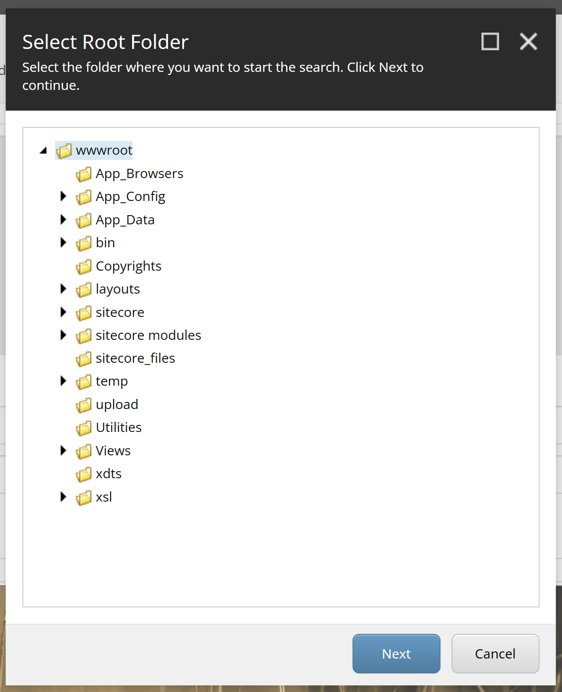

**Step 7b — Specify Source Filters.** Title **Specify Source Filters**. The file filter set is
**smaller than the item one** — no template/language/account filters:

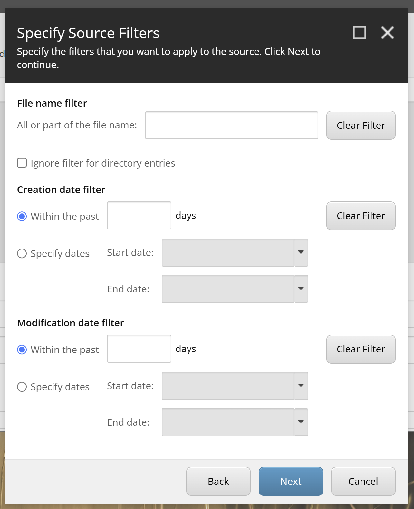

- **File name filter** — *All or part of the file name:* (text) + **Clear Filter**.
- **Ignore filter for directory entries** — checkbox (**unchecked** by default) — when set, the
  name filter applies to files only, not folders.
- **Creation date filter** — **Within the past** `[ ]` **days** / **Specify dates** (Start/End).
- **Modification date filter** — same shape.
- Footer: **Back** / **Next** / **Cancel** (then a source-name step).

Serializes to the dynamic `<files>` source ([[package-definition-xml]]).

> **→ Our app:** also **out of scope for SitecoreAI** (no file system). Kept for completeness.

### 8. Security accounts

Clicking **Security accounts** opens a two-dialog flow for adding users/roles to the package.

**Step 8a — Add Security Accounts (the package's account list).** Modal titled **Add Security
Accounts**, subtitle *"Select the security accounts that you want to add to the package. To add
other users or roles to this list, click Add."*

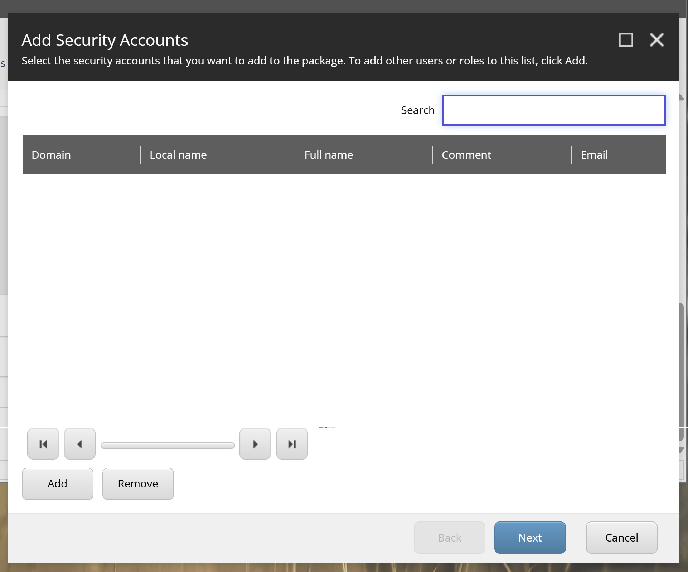

- A **Search** box (top-right).
- A grid of accounts already added, columns: **Domain | Local name | Full name | Comment | Email**.
- A **pager** (first / prev / slider / next / last) for long lists.
- **Add** / **Remove** buttons.
- Footer: **Back** (disabled here) / **Next** / **Cancel**.

**Step 8b — Add an Account (the picker).** Clicking **Add** opens **Add an Account**, subtitle
*"Select an account type and then click the relevant role or user."*

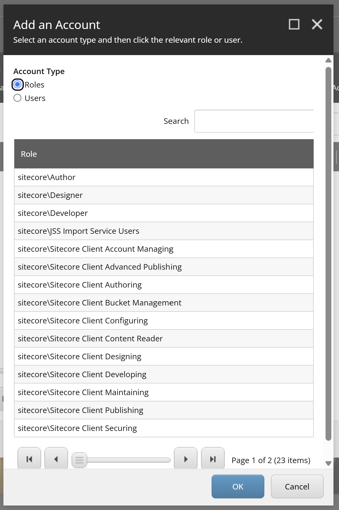

- **Account Type** radios: **Roles** (default) / **Users**.
- A **Search** box.
- A grid (column **Role** when Roles is selected) listing accounts as `domain\Name` —
  e.g. `sitecore\Author`, `sitecore\Designer`, `sitecore\Developer`,
  `sitecore\Sitecore Client Authoring`, … — with a pager (*Page 1 of 2 (23 items)*).
- Footer: **OK** / **Cancel**. Selecting a row and **OK** adds it back to the Step-8a list.

This builds the `<accounts>` static source; on install, roles import as membership and users as
properties+profile ([[security-accounts]]).

> **→ Our app:** **out of scope for SitecoreAI** — XM Cloud uses a different identity/security
> model (Sitecore Cloud Portal / organization roles), so packaged users & roles don't map cleanly.
> Documented for format completeness; the app's *Create* flow is items-only ([[sitecore-marketplace-app]]).

### 9. Installation options (per source)

This is where each source pre-declares how the installer should resolve collisions — it's the
design-time twin of the install-time conflict dialog ([[installation-wizard-ui]] Screen 8).

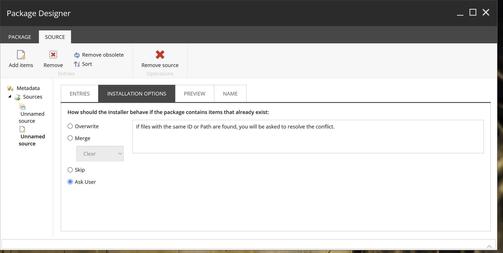

Selecting a source reveals the **INSTALLATION OPTIONS** tab. Heading: *"How should the installer
behave if the package contains items that already exist:"* Options (radio):

- **Overwrite** — replace the existing item (and subtree) with the package version.
- **Merge** — enabled with a sub-dropdown whose values are **Clear / Append / Merge**:
  - *Clear* — replace the item's versions with the package's.
  - *Append* — add the package's versions on top, renumbered (keeps existing).
  - *Merge* — replace overlapping versions, keep the rest.
- **Skip** — leave the existing item untouched.
- **Ask User** — **default (selected)**; defer the decision to install time.

A description box to the right updates with the selected mode; for **Ask User** it reads: *"If files
with the same ID or Path are found, you will be asked to resolve the conflict."* (Sitecore uses the
generic "files…ID or Path" wording even for item sources.)

**File sources omit Merge.** For a *file* source the same tab offers only **Overwrite / Skip / Ask
User** (no Merge sub-dropdown) — files can't be version-merged:

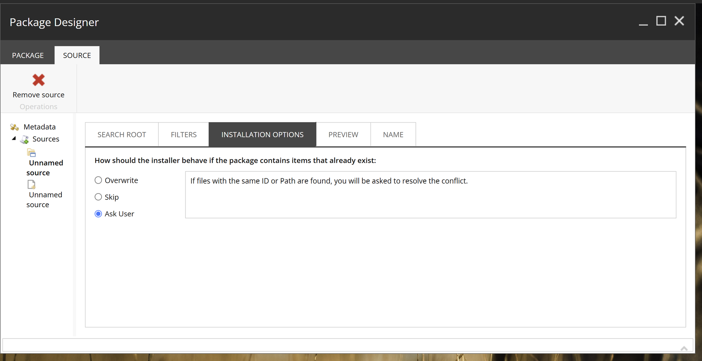

These modes correspond exactly to the install pipeline's `InstallMode` (Overwrite/Merge/SideBySide)
and `MergeMode` (Append/Merge/Clear) documented in [[package-installation]].

> **→ Our app:** replicate this radio + Merge-submode control **per source**, defaulting to **Ask
> User**, and carry the choice into the package so install-time behavior matches. This is the pivot
> point that makes our *Create* and *Install* flows agree on collision handling
> ([[item-serialization]]).

### 10. Source config tabs & the contextual SOURCE ribbon

When you select a source, two things change from the Metadata view:

**A contextual ribbon** appears with two top-level tabs — **PACKAGE** and **SOURCE**. The **SOURCE**
ribbon's buttons depend on the source type:

| Source type | Ribbon groups |
|-------------|---------------|
| **Static** (Items/Files statically) | **Entries**: Add items · Remove · Remove obsolete · Sort — and **Operations**: Remove source |
| **Dynamic** (Items/Files dynamically) | **Operations**: Remove source only (entries are query-resolved, so no manual Add/Remove/Sort) |

**The content-pane tabs also depend on the source type:**

- **Static source** → **ENTRIES · INSTALLATION OPTIONS · PREVIEW · NAME**
  - **ENTRIES** — the explicit item/file list this source contributes (Add/Remove/Sort via the
    ribbon; **Remove obsolete** prunes entries that no longer exist).
- **Dynamic source** → **SEARCH ROOT · FILTERS · INSTALLATION OPTIONS · PREVIEW · NAME**
  - **SEARCH ROOT** — re-pick the root item/folder (Screen 5a / 7a).
  - **FILTERS** — re-edit the filter chain (Screen 5b / 7b).

Common to both:

- **INSTALLATION OPTIONS** — the collision behavior (Screen 9).
- **PREVIEW** — a read-only listing of what the source resolves to (Entry Key / Installation options
  columns; for dynamic sources this re-runs the query).
- **NAME** — rename the source.

The left nav shows **Metadata** and **Sources**, with each added source listed beneath **Sources**
(e.g. two *Unnamed source* entries until named via the **NAME** tab or the source-name step). Source
icons differ by kind (dynamic-items, static-file, etc.).

> **→ Our app:** model a selected-source detail panel whose tabs switch on source type (static →
> Entries; dynamic → Search root + Filters), plus shared Installation options / Preview / Name tabs,
> and a source toolbar (Add items, Remove, Remove obsolete, Sort, Remove source).

### 11. Save / load project

A package *project* (the definition: metadata + sources, **not** the built zip) is persisted as an
XML file on the server (under `Data/packages`). **Save as** and **Open** share the same dialog
chrome — a project-file browser.

**Save** — modal titled **Save project**, subtitle *"Enter a name for the project file."*

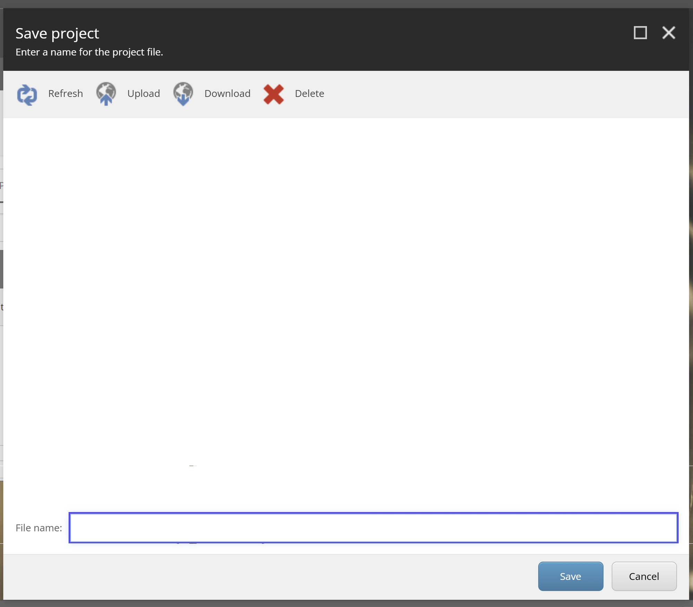

**Open** — modal titled **Project**, subtitle *"Select a project to open."*

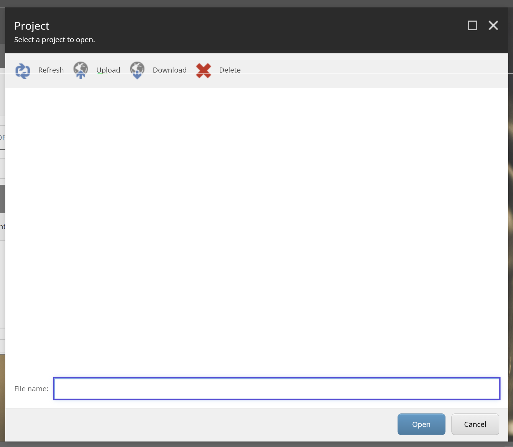

Both have:

- A toolbar: **Refresh** · **Upload** (globe + up-arrow — upload a project file from your machine) ·
  **Download** (globe + down-arrow — download the selected project file) · **Delete** (red ✖).
- A list area of existing project files (empty in these captures).
- A **File name:** text field.
- Footer: **Save** / **Cancel** (Save dialog) or **Open** / **Cancel** (Open dialog).

The saved project is the XML described in [[package-definition-xml]] (the same content that ends up
as `installer/project` inside a built package).

> **→ Our app:** offer save/open of the package *definition* (our equivalent of the project XML) so
> users can re-generate or tweak later. Upload/Download map to import/export of that definition. On
> SitecoreAI there's no server `Data/packages`, so projects would live in app/browser storage or be
> downloaded as files.

### 12. Generate Zip + download

Clicking **Generate ZIP** builds the actual package (the two-layer zip described in
[[package-format]]) from the current definition.

**Step 12a — Package Name.** Modal titled **Package Name**, subtitle *"Enter a name for the package.
Click Next to continue."*

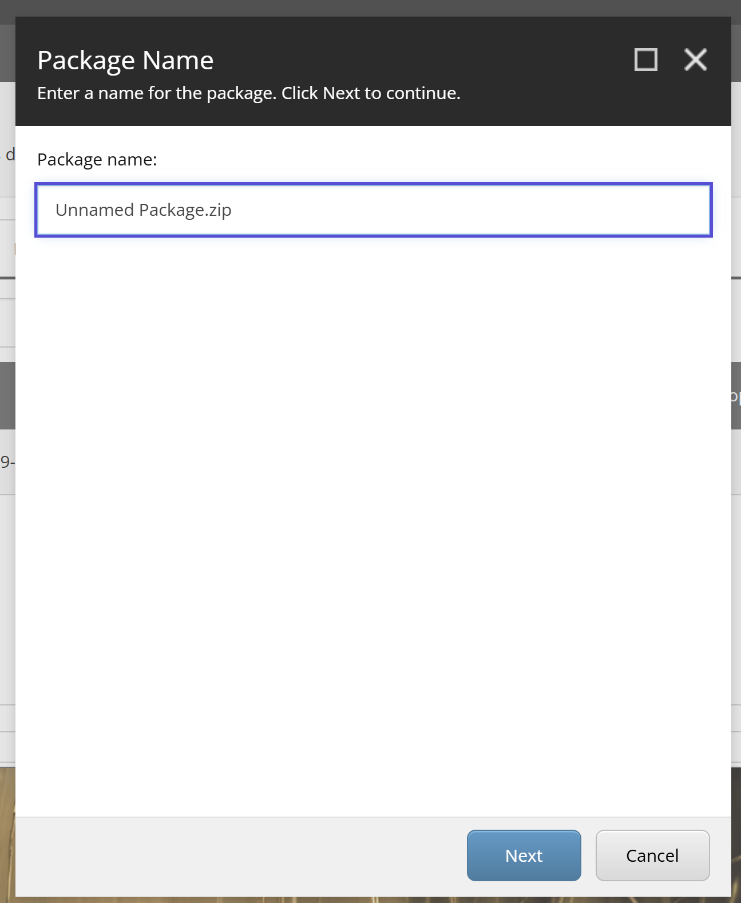

- **Package name:** text field, pre-filled with **`Unnamed Package.zip`** (i.e. the `.zip`
  extension is part of the default).
- Footer: **Next** / **Cancel**.

**Step 12b — Generate & download.** After **Next**, the designer runs the generation pipeline
([[package-creation]]) and writes the zip to the server's `Data/packages`. A completion/download
step follows (same **Download** globe + down-arrow affordance seen in the Save/Open project dialogs,
Screen 11) to pull the `.zip` to your machine.

> **→ Our app:** the *Create* flow's final step — name the package, then **build the two-layer zip
> client-side (or via a server route) and trigger a browser download**. No `Data/packages` on
> SitecoreAI, so generation output goes straight to the user. This is where our package-writer
> ([[package-creation]], [[item-serialization]]) must produce a byte-compatible zip.

## Sources

- **User-supplied screenshots of a live Sitecore 10.x Package Designer**, 2026-06-22 (primary ground
  truth — every screen above is transcribed from a real screenshot in `wiki/assets/package-designer/`).
- Research sweep (Sitecore docs incl. SDN archive + community blogs: getfishtank.com, mysitecore.blog,
  sitecoreinfo.blogspot.com, neilkillen.com, sourceved.com), 2026-06-21 — used for context; the live
  UI (ribbon groups Project/Add/Build/Install; flat Add row; Preview & Launch wizard buttons)
  superseded older descriptions where they differed.
- Source/definition semantics cross-referenced with [[package-definition-xml]], [[package-creation]],
  [[package-installation]] (decompiled `Sitecore.Kernel`).
